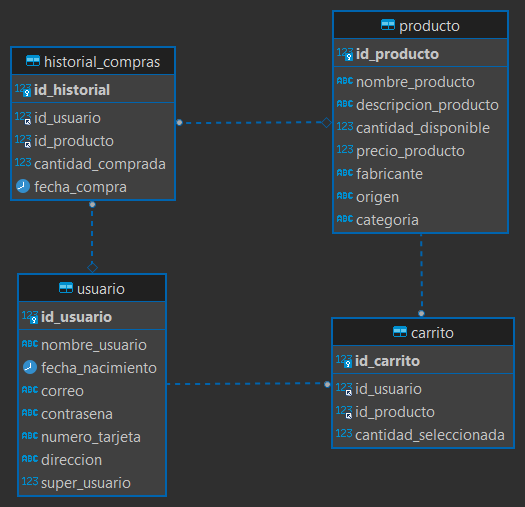

# Tienda-Online

El proyecto es una versión simplificada de una tienda online, con conexión a una base de datos MariaDB, cuenta con lista de productos, carrito personal, historial de compras para el administrador y posibilidad de modificar la información de los productos.

## Instalación

1. Descargar el respositorio en un directorio en que se pueda ejecutar tanto el PHP, como SQL. Por ejemplo: al utilizar XAMPP se puede colocar dentro del directorio `htdocs` o en un directorio interno especial.
2. Crear una base de datos en el sistema manejador que se esté utilizando, hay un documento SQL de inserción de datos para prueba en el archivo [`tienda_online.sql`](DB/tienda_online.sql) con el que se puede visualizar tanto la forma en que se creó y modeló la base de datos, como la forma en que se deben realizar las distintas consultas si es que se desean agregar más archivos con conexión a la misma.
3. Realizar la configuración de parametros para la conexión personalizada a la base de datos utilizada en el archivo [`config.php`](config/config.php)
4. Una vez seguidos los pasos anteriores, se debe tener corriendo el servicio de PHP junto con el de SQL para poder probar 

## Estructura de la DB

## Estructura de las páginas

* main, lista de productos
  * muestra los productos existentes aunque no se inicie sesión
    * se tienen contemplados los casos de tratar de comprar sin iniciar sesión
* inicio de sesión, registro
  * permite iniciar sesión a un usuario o crear uno (sin permisos especiales)
* página del administrador
  * al iniciar sesión como un usuario administrador se muestran 2 opciones extra que son la consulta de historial de ventas y modificación de productos
* información del usuario
  * todos los datos del mismo
* carrito de compras del usuario
  * lista personalizada que posee un usuario donde puede guardar las cosas que desea comprar en otro momento

## Licencia

MIT
